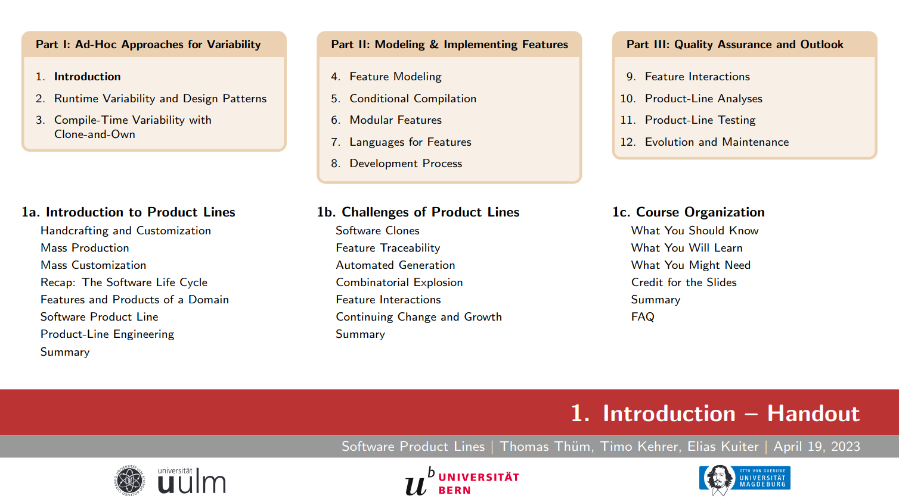

# Course on Software Product Lines

**[Open educational resources](https://en.wikipedia.org/wiki/Open_educational_resources) on software product lines**

* **LaTeX Slides**: Material for lectures on software product lines 
* [LaTeX Exercises](https://github.com/SoftVarE-Group/Course-on-Software-Product-Lines-Exercises): Material for exercises on software product lines (available on request)
* [PDF Slides](https://github.com/SoftVarE-Group/Slides-of-the-SPL-Course): Released version of slides for the lecture on software product lines
* [Recordings](https://www.youtube.com/playlist?list=PL4hJhdKDPIxha8So7muX2zfNUU8NBoiu3): YouTube playlist with lecture recordings


*If you have any feedback, please contact [Thomas Thüm](mailto:thomas.thuem@uni-ulm.de).*

<a href="https://github.com/SoftVarE-Group/Slides-of-the-SPL-Course">
<picture>
  <source media="(prefers-color-scheme: dark)" srcset="pics/course/overview-dark.png">
  
</picture>
</a>

## Contact

Core contributors:

- [Thomas Thüm](https://www.uni-ulm.de/in/sp/team/thuem/) (University of Ulm, Germany)
- [Timo Kehrer](https://www.inf.unibe.ch/ueber_uns/personen/seg/prof_dr_kehrer_timo/index_ger.html) (University of Bern, Switzerland)
- [Elias Kuiter](https://www.dbse.ovgu.de/Mitarbeiter/Elias+Kuiter.html) (University of Magdeburg, Germany)

Further contributors and former project members:

- [Sebastian Krieter](https://www.uni-ulm.de/in/sp/team/sebastian-krieter/) (University of Ulm, Germany)

## Usage in Lectures

- Paderborn University, Germany: Software Product Lines (Summer Term 2024)
- University of Bern, Switzerland: Software Product Lines (Winter Term 2022/23, Winter Term 2023/24)
- University of Magdeburg, Germany: Implementation Techniques for Software Product Lines (Winter Term 2022/23, Winter Term 2023/24)
- Harz University of Applies Sciences, Wernigerode, Germany: Requirements Engineering II - Software Product Lines (Summer Term 2023)
- University of Ulm, Germany: Software Product Lines (Summer Term 2023)

## Getting Started

```
git clone --recursive https://github.com/SoftVarE-Group/Course-on-Software-Product-Lines.git
cd Course-on-Software-Product-Lines/slides
make # to compile all slides with default options
make <lecture>.pdf handout=... darkmode=... university=... # to compile one lecture with given options (for valid values, see Makefile)
docker run --rm -v $(pwd)/..:/spl -w /spl/slides texlive/texlive:TL2021-historic make # to compile all slides with Texlive 2021 in Docker
```

## License

All course material is licensed under the <a href="http://creativecommons.org/licenses/by-sa/4.0/">CC-BY-SA-4.0</a> license (Creative Commons Attribution Share Alike).

<p align="center">
	<a href="http://creativecommons.org/licenses/by-sa/4.0/"></a>
</p>

<p align="center">
	<a href="https://creativecommons.org/share-your-work/public-domain/freeworks"></a>
</p>
